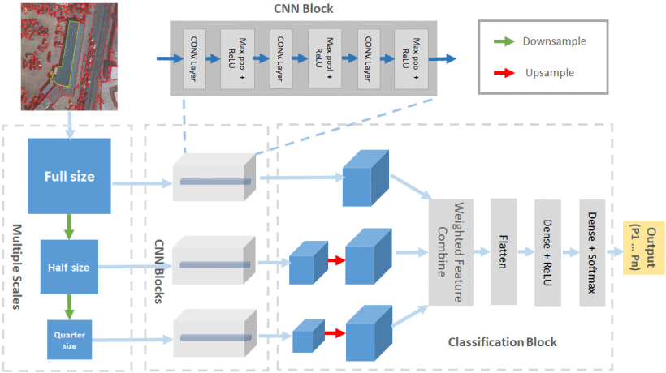

# Adaptive Multiscale Superpixel Embedding Convolutional Neural Network for Land Use Classification

This repository is the official implementation of [Adaptive Multiscale Superpixel Embedding Convolutional Neural Network for Land Use Classification](https://ieeexplore.ieee.org/document/9875975).

Code to build and train the networks are provided. The model takes in a provided remote sensing image and produces a colour coded output depending on provided categories.

> :warning: 

**This code currently has an undetermined memory issue as a result of incompatibility between older code library versions**: 

It is not advised to run this code right now and any responsibility will fall onto the user for subsequent issues if used!

> :warning:


AMUSE-CNN Architecture


Multi-Scale CNN Architecture

## Published Results

 Comparison Among OBIA-SVM, Pixelwise CNN, OCNN, MS-CNN, and AMUSE-CNN for Lagos")
Classification Accuracy (%) Comparison Among OBIA-SVM, Pixelwise CNN, OCNN, MS-CNN, and AMUSE-CNN for Lagos


2000 × 2000 pixel Lagos image region and the corresponding GT as well as LU classification for all the methods.

<br><br>

 Comparison Among OBIA-SVM, Pixelwise CNN, OCNN, MS-CNN, and AMUSE-CNN for Kano")
Classification Accuracy (%) Comparison Among OBIA-SVM, Pixelwise CNN, OCNN, MS-CNN, and AMUSE-CNN for Kano


2000 × 2000 pixel Kano image region and the corresponding GT as well as LU classification for all the methods.

## Paper

[IEEE Journal of Selected Topics in Applied Earth Observations and Remote Sensing](https://ieeexplore.ieee.org/document/9875975)

## Abstract

Currently, a large number of remote sensing images with different resolutions are available for Earth observation and land monitoring, which are inevitably demanding intelligent analysis techniques for accurately identifying and classifying land use (LU). This article proposes an adaptive multiscale superpixel embedding convolutional neural network architecture (AMUSE-CNN) for tackling LU classification. Initially, the images are parsed via the superpixel representation so that the object-based analysis (via a superpixel embedding convolutional neural network scheme) can be carried out with the pixel context and neighborhood information. Then, a multiscale convolutional neural network (MS-CNN) is proposed to classify the superpixel-based images by identifying object features across a variety of scales simultaneously, in which multiple window sizes are used to fit to the various geometries of different LU classes. Furthermore, a proposed adaptive strategy is applied to best exert the classification capability of the MS-CNN. Subsequently, two modules are developed to fully implement the AMUSE-CNN architecture. More specifically, Module I is to determine the most suitable classes for each window size (scale) by applying majority voting to a series of MS-CNNs Module II carries out the classification of the classes identified in Module I for the given scale used in the MS-CNN and, therefore, complete the LU classification of the entire classes. The proposed AMUSE-CNN architecture is both quantitatively and qualitatively validated using remote sensing data collected from two cities, Kano and Lagos in Nigeria, due to the spatially complex LU distribution. Experimental results show the superior performance of our approach against several state-of-the-art techniques.

## Requirements

### Python and Operating System

The following code was written in Python 3.8 and run in Windows 10.

The requirements list below contains all packages that <b>must</b> be installed in order for the code to run correctly.

```
rtools==9.0.9048
rasterio~=1.1.7
numpy~=1.19.4
shapely~=1.7.1
affine~=2.3.0
scikit-learn~=0.23.2
tensorflow~=2.4.1
tqdm~=4.50.2
fiona~=1.8.17
geopandas~=0.8.1
scipy~=1.5.2
matplotlib~=3.3.2
pillow~=7.2.0
scikit-image~=0.17.2
```

To install these packages, either copy the above into a text file, or download the requirements.txt file within the repository and install using pip as shown below

```setup
pip install -r requirements.txt
```

Note: While operations can be performed using a CPU based tensorflow installation, it will be extremely slow and therefore a GPU based installation is recommended.


Tensorflow will require additional support to make use of GPU support. Details of these required elements can be found at

[Tensorflow GPU Support](https://tensorflow.org/install/gpu)

## Dataset Generation
During training of any model, a set of five dataset files will be generated containing all geo_data information in a format readable by the models. These files are as follows:

- `lc_am.pkl` (Container file holding all land cover annotations)
- `lu_am.pkl` (Container file holding all land use annotations)
- `relevant_pixels.pkl` (Container file holding all land cover probabilities in a memory-efficient manner)
- `rgb_c.pkl` (Container file containing all RGB data regarding geo_data)
- `seg_c.pkl` (Container file containing all segment information from geo_data)

Please do not attempt to edit these files or the code that creates them as this will prevent further code from running.

## Quick-start 

To conduct K-Fold cross validation experiments upon provided data, the following can be ran in order to load the main script into the console. 

`python main.py -md YOUR_CHOSEN_DIRECTORY`

where `-md` specifies the model directory. The following arguments may also be passed: 

- `-lc` with a path to LC annotation directory (defaults to `geo_data/K_R3C4/lc_annotations`)
- `-lu` with a path to LU annotation directory (defaults to `geo_data/K_R3C4/lu_annotations`)
- `-s` with a path to segmentation shapefile (defaults to `geo_data/K_R3C4/R3C430_8_196_full_tif.shp`)
- `-tp` with a path to EO data .tif file (defaults to `geo_data/K_R3C4/NI_Kano_20Q1_V0_R3C4.tif`)
- `-ws` sizes of data window in pixels (defaults to [48, 96]). Window sizes must be presented in a space
separated list of window sizes e.g. -ws 48 96 120 160

<br>

Two different datasets are available for use in experiments, namely the Kanos and Lagos datasets, each found in their own folders of:
- `geo_data/K_R3C4` for Kano based data
- `geo_data/L_R6C6` for Lagos based data

To use either of these datasets, please specify the above parameters according to the dataset required, with both directories containing identical structures and files, just with differing names.

For example

- Kano Segmentation Shapefile:  `geo_data/K_R3C4/R3C430_8_196_full_tif.shp`
- Kano EO data .tif file: `geo_data/K_R3C4/NI_Kano_20Q1_V0_R3C4.tif`

<br>

- Lagos Segmentation Shapefile:  `geo_data/L_R6C6/R6C630_8_196_full_tif.shp`
- Lagos EO data .tif file: `geo_data/L_R6C6/NI_Lagos_19Q2_V0_R6C6.tif`

Once all relevant annotation managers and containers have been created or loaded, a menu will be presented in which a model will need to be selected for training.

The menu presented on the console is largely dependent on the number of window sizes that are provided as an argument.

If only a single window size is provided, the following menu will be presented

1. `Multi-Scale CNN`
2. `OCNN Benchmark`
3. `Pixelwise CNN`
4. `OBIA SVM`
5. `MS-CNN and OCNN Benchmark Dual Mode`

After selecting a model, an input prompt will be loaded asking for specification of which value of K should be used in K-Fold evaluation metrics.

However, if multiple window sizes are provided, the only suitable methodology for use is that of the adaptive MS-CNN methodology, and therefore only one menu item will be presented.

1. `Adaptive Multi-Scale CNN`


The selected model will then be trained and evaluated automatically, with the relevant files being saved in the specified directory.

#
The following sections provide a detailed overview of each code script within the repository in it's individual form and how to use the script outside of the `main.py` menu script.
#
## Run

This script is used to generate all models in which a single window size is used, namely that of:

1. `Multi-Scale CNN`
2. `OCNN Benchmark`
3. `Pixelwise CNN`
4. `OBIA SVM`
5. `MS-CNN and OCNN Benchmark Dual Mode`

Run this file with the appropriate flags, which are largely similar to that of the `main.py` script, as detailed below.

`python run.py -md YOUR_CHOSEN_DIRECTORY`

where `-md` specifies the model directory. The following arguments may also be passed: 

- `-lc` with a path to LC annotation directory (defaults to `geo_data/K_R3C4/lc_annotations`)
- `-lu` with a path to LU annotation directory (defaults to `geo_data/K_R3C4/lu_annotations`)
- `-s` with a path to segmentation shapefile (defaults to `geo_data/K_R3C4/R3C430_8_196_full_tif.shp`)
- `-tp` with a path to EO data .tif file (defaults to `geo_data/K_R3C4/NI_Kano_20Q1_V0_R3C4.tif`)
- `-ws` size of data window in pixels (defaults to 96).

At the end of the `run.py` file, there is a piece of code within a

```python
if __name__ == "__main__":
    pass
```

block.

By default it contains code which:

- parses flags/arguments
- loads/configures global variables which are contained in `config.py`
- configures GPU(s) for Tensorflow where available
- creates a `LandCoverAnnotationManager`, a `LandUseAnnotationManager`, a `RGBContainer`, a `SegmentContainer`, and a `LCProbabilityContainer` (this may take 30-60 minutes but will massively reduce computational time later) and saves them in `config.MODELS_DIRECTORY` or if they already exist in this directory then they are loaded

Following this, it will load the menu mentioned above in which you are required to select the relevant model type, and the number of folds for K-Fold accordingly.

#

> :warning: 

## Adaptive Multi Scale (AMUSE)


### Warning: This script will create a large amount of data to complete operations. If using 3+ window sizes, please ensure that a large amount of storage space is available in the specified directory (around 50-100GB+).

<br>

> :warning: 

This script is used for the complete runtime of the adaptive MS-CNN system.

This system is largely an automatic system and therefore no outside interference is needed from the user
once parameters have been specified.

Run this file with the appropriate flags, which are identical to that of the `main.py` script, with slight differences, as detailed below.

`python adaptive_multi_scale.py -md YOUR_CHOSEN_DIRECTORY`

where `-md` specifies the model directory. The following arguments may also be passed: 

- `-lc` with a path to LC annotation directory (defaults to `geo_data/K_R3C4/lc_annotations`)
- `-lu` with a path to LU annotation directory (defaults to `geo_data/K_R3C4/lu_annotations`)
- `-s` with a path to segmentation shapefile (defaults to `geo_data/K_R3C4/R3C430_8_196_full_tif.shp`)
- `-tp` with a path to EO data .tif file (defaults to `geo_data/K_R3C4/NI_Kano_20Q1_V0_R3C4.tif`)
- `-ws` sizes of data window in pixels (defaults to [48, 96]). Window sizes must be presented in a space
separated list of window sizes e.g. -ws 48 96 120 160

At the end of the `adaptive_multi_scale.py` file, there is a piece of code within a

```python
if __name__ == "__main__":
    pass
```
block.

By default it contains code which:

- parses flags/arguments
- loads/configures global variables which are contained in `config.py`
- configures GPU(s) for Tensorflow where available
- Creates initial data for class assignment, with 4n sets of data and models created, where n = number of window sizes provided. In this the system:
    - creates a `LandCoverAnnotationManager`, a `LandUseAnnotationManager`, a `RGBContainer`, a `SegmentContainer`, and a `LCProbabilityContainer` (this may take 30-60 minutes but will massively reduce computational time later) and saves them in `config.MODELS_DIRECTORY` or if they already exist in this directory then they are loaded
- Uses a majority vote system to automatically assign each class to it's highest performing window size.
- Trains new models for each window size in which the most suitable classes are contained.
- Combines accuracy output into a singular .JSON output file

#

## Project Metrics

This script is used for the generation of accuracies for each individual model type, once training has been completed. 

Note: This script cannot be used to generate accuracies for the AMUSE system as this is done automatically during runtime.

Run this file with the appropriate flags, which are largely similar to that of the `main.py` script, as detailed below.

`python run.py -md YOUR_CHOSEN_DIRECTORY`

where `-md` specifies the model directory. The following arguments may also be passed: 

- `-lc` with a path to LC annotation directory (defaults to `geo_data/K_R3C4/lc_annotations`)
- `-lu` with a path to LU annotation directory (defaults to `geo_data/K_R3C4/lu_annotations`)
- `-s` with a path to segmentation shapefile (defaults to `geo_data/K_R3C4/R3C430_8_196_full_tif.shp`)
- `-tp` with a path to EO data .tif file (defaults to `geo_data/K_R3C4/NI_Kano_20Q1_V0_R3C4.tif`)
- `-ws` size of data window in pixels (defaults to 96).

Once all relevant files and parameters have been loaded in, a menu will be presented to the user in which a series of different models can be selected in order to generate the relevant accuracies.

1. `Multi-Scale CNN`
2. `OCNN Benchmark`
3. `OBIA SVM`
4. `Pixelwise CNN`
5. `MS-CNN and OCNN Benchmark Dual Mode`

Once an input has been selected, the relevant accuracies for the model in question will be generated.

As a result of this procedure, two .JSON files will be created in the specified model directory. One of which will provide an overall accuracy for the model in question, while another will present a detailed breakdown of the accuracy of the model when faced with each individual class.

#

## Plotting Functions

This script is used for the creation of a series of individual figures that can be used to provide a pictorial representation of the classification ability of individual models, along with other elements.

Note: This script cannot be used to generate pictorial representations for the entire AMUSE system output. Instead, each individual model created by the AMUSE system will need to be specified individually by the `-md` parameter for use and then combined at the users' discretion.

Run this file with the appropriate flags, which are largely similar to that of the `main.py` script, as detailed below.

`python project_metrics.py -md YOUR_CHOSEN_DIRECTORY`

where `-md` specifies the model directory. The following arguments may also be passed: 

- `-lc` with a path to LC annotation directory (defaults to `geo_data/K_R3C4/lc_annotations`)
- `-lu` with a path to LU annotation directory (defaults to `geo_data/K_R3C4/lu_annotations`)
- `-s` with a path to segmentation shapefile (defaults to `geo_data/K_R3C4/R3C430_8_196_full_tif.shp`)
- `-tp` with a path to EO data .tif file (defaults to `geo_data/K_R3C4/NI_Kano_20Q1_V0_R3C4.tif`)
- `-ws` size of data window in pixels (defaults to 96).

Once all relevant files and parameters have been loaded in, a menu will be presented to the user in which a series of different diagrams can be selected in order to generate the relevant figure.

1. `Plot Data`
2. `Plot Annotations`
3. `Plot Segments`
4. `Plot K-Fold Accuracies`
5. `Plot Model Architecture`
6. `Plot LU Colored Tiles (Work In Progress - Do not use)`
7. `Plot Complete LU Coloured`
8. `Plot Errors`

Each figure selected will be saved in it's own specific folder within the main `figures` folder. The recently created figure will be visible by the date and time used to form the name of the image.

#

## Repository structure

Note: <br>
Shown below is only an example of elements contained within a single folder in each directory, corresponding to a particular window size or dataset depending on the model.

Other folders are also available within these directories corresponding to alternative window sizes and datasets that can be explored at the readers discretion.

- `installation/` (Wheel files that may be needed to install packages on Windows systems)
- `figures/` (Directory for created figures) <br>*NOTE: Some figure folders are currently being rearranged in accordance with changes to plotting figures code and therefore this folder is currently unavailable*
    - `architectures/` (Complete MS-CNN Architecture Diagrams)
    <!--- `colored_tiles/` (...)-->
    - `complete_lu/` (Complete TIF Image Annotated With LU Classes)
    - `plot_annotations/` (All Annotations For All K-Folds)
    - `plot_data/` (Kano and Lagos Data Images)
    - `image_region` (Singular coordinate defined region)
    - `plot_segments/` (Segments Of Images From Segmentation File)
    - `lu_prc` (Precision Recall Curves)
    - `lu_roc` (Reciever Operating Characteristic Curves)<br><br>
- `geo_data/` (Directory for geospatial data)<br>*NOTE: These data files are too large for storage on GitHub and can instead be found on the [Edge Hill Figshare platform](#)*
    - `K_R3C4/` (Kano data for R3C4 tile)
        - `lc_annotations/` (Land cover annotations directory)
        - `lu_annotations/` (Land use annotations directory)
        - `NI_Kano_20Q1_V0_R3C4.tif` (Data file)
        - `R3C430_8_196_full_tif.shp` (Complete Segmentation Shapefile)
        - `segments.*` (Accompanying mean-shift segmentation files/superpixels)
    - `L_R6C6/` (Lagos data for R3C4 tile)
        - `lc_annotations/` (Land cover annotations directory)
        - `lu_annotations/` (Land use annotations directory)
        - `NI_Kano_19Q2_V0_R6C6.tif` (Data file)
        - `segments.*` (Mean-shift segmentation files/superpixels)<br><br>
- `raw_data_info\` (Raw information regarding `geo_data` files)
- `models/` (Directory for saving models)
    - `multi_scale/` (Contains MS-CNN  models and files)
        - `48/` (Contains MS-CNN model files with window size 48)
            - `Kano/` (Contains model files trained on Kano data)
                - `multiscale_X.h5` (Saved MS-CNN model for Xth fold of K-fold cross-validation)
                - `seg_c_p_c_ms_X.npy` (Saved segment LU probabilities from MS-CNN output of Xth fold of K-fold cross-validation)
                - `per_class_accuracy_average.json` (Average accuracy achieved using MS-CNN for each LU class (average refers to average of K-fold cross-validation experiments))
                - `oa_averaged_over_k_folds.json` (Average validation set area correctly labelled by MS-CNN (average refers to average of K-fold cross-validation experiments))
                <br><br>
    - `obia_svm/` (Contains OBIA-SVM models and files)
        - `Kano/` (Contains model files trained on Kano data)
            - `obia_svm_model_X.pkl` (Saved OBIA-SVM model for Xth fold of K-fold cross-validation)
            - `seg_c_p_c_obia_svm_X.npy` (Saved segment LU probabilities from output of Xth fold of K-fold cross-validation)
            - `per_class_accuracy_average.json` (Average accuracy achieved for each LU class (average refers to average of K-fold cross-validation experiments))
            - `oa_averaged_over_k_folds.json` (Average validation set area correctly labelled (average refers to average of K-fold cross-validation experiments))<br><br>
    - `pixelwise_cnn/` (Contains pixelwise CNN models and files)
        - `48/` (Contains pixelwise CNN model files with window size 48)
            - `Kano/` (Contains model files trained on Kano data)
                - `pixelwiseX.h5` (Saved pixelwise CNN model for Xth fold of 5-fold cross-validation)
                - `pixel_probabilities_pixelwise_X.npy` (Selected pixel LU probabilities output from Xth fold of 5-fold cross-validation)
                - `pixel_idx_mapX.npy` (Contains the pixel indexes used to determine which pixels the probabilities in `pixel_probabilities_pixelwise_X.npy` refer to)
                - `per_class_accuracy_average.json` (Average accuracy achieved for each LU class (average refers to average of 5-fold cross-validation experiments))
                - `oa_averaged_over_k_folds.json` (Average validation set area correctly labelled (average refers to average of 5-fold cross-validation experiments))<br><br>
    - `ocnn` (Contains OCNN models and files)
        - `48/` (Contains OCNN model files with window size 48)
            - `Kano/` (Contains model files trained on Kano data)
                - `multiscale_X_benchmark.h5` (Saved OCNN file for Xth fold of K-fold cross-validation)
                - `seg_c_p_c_ocnn_X.npy` (Saved segment LU probabilities from OCNN output of Xth fold of K-fold cross-validation)
                - `benchmark_per_class_accuracy_average.json` (Average accuracy achieved using OCNN for each LU class (average refers to average of K-fold cross-validation experiments))
                - `benchmark_oa_averaged_over_k_folds.json` (Average validation set area correctly labelled by OCNN (average refers to average of K-fold cross-validation experiments))<br><br>
    - `adaptive_multiscale` (Contains AMUSE models and files)
        - `Kano/` (Contains model files trained on Kano data)
            - `new_data` (Classification results and model data generated by module 2)
                - `48` (Model data and results generated during running of module 2)
                    - `multiscale_X.h5` (Saved AMUSE file for Xth fold of K-fold cross-validation)
                    - `seg_c_p_c_ms_X.npy` (Saved segment LU probabilities from AMUSE output of Xth fold of K-fold cross-validation)
                    - `per_class_accuracy_average.json` (Average accuracy achieved using AMUSE for each LU class at window size 48 (average refers to average of K-fold cross-validation experiments))
                    - `oa_averaged_over_k_folds.json` (Average validation set area correctly labelled by AMUSE at window size 48 (average refers to average of K-fold cross-validation experiments))
            - `temp_data`
                - `48` (Classification results and model data generated for window size 48 during module 1)
                    - `0` (Model data and results generated during running of fold 0 for window size)
            - `temp_shapefiles`
                - `48` (Shapefiles assigned to window size 48 after module 1 is completed)
            - `combined_accuracies_over_5_folds_all_ws.json` (Average accuracy achieved using AMUSE for each LU class (average refers to average of K-fold cross-validation experiments). Results are combined across all window sizes used in AMUSE)
            - `oa_combined_averaged_over_5_folds.json` (Average validation set area correctly labelled by OCNN (average refers to average of K-fold cross-validation experiments). Results are combined across all window sizes used in AMUSE)<br><br>
- `adaptive_multi_scale.py` (File used to handle the main runtime of the adaptive MS-CNN [AMUSE] system)
- `config.py` (File used to store global variables which `run.py`, `plotting_functions.py` or `project_metrics.py` might access)
- `housekeeping.py` (File used to mitigate memory issues when training models on an NVIDIA GPU and a Windows Operating System. Sourced from https://github.com/CallumAltham/Tensorflow-NVIDIA-Fix)
- `land_classes.py` (File which contains `LandClasses`, `LandCoverClasses` and `LandUseClasses` classes which are used to translate between integer representations of LU and the actual LU class names/colours allocated to them as described by `geo_data/K_R3C4/lu_annotations/classes.json` file or such-like)
- `main.py` (File used to handle the main menu functionality of the overall system)
- `mlps.py` (File used to handle mostly unused but potentially important MLP based code)
- `multi_scale_ocnn.py` (File containing all code used to generate models based on the MS-CNN and OCNN architectures, including: a singular ms-cnn, a singular ocnn, a ms-cnn and ocnn together. An additional function exists to facilitate ms-cnn training during AMUSE modules)
- `ocnns.py` (File used to handle mostly unused but potentially important OCNN based code for reference)
- `plotting_functions.py` (File which contains many (often very long/messy) functions used to plot figures at various points during the project) ** File currently unavailable due to changes being made**
- `project_metrics.py` (File which has functions to calculate OBIA-SVM/Pixelwise CNN/OCNN/MS-CNN/AMUSE accuracies.)
- `requirements.txt` (File containing all required packages that can be used by pip package manager to install dependencies, as mentioned above.<br> Note: Some packages such as Rasterio, Fiona, Shapely may require external dependencies that will need to be installed.)
- `results.py` (Used in the generation of metrics and imagery)
- `run.py` (File which contains the bulk of classes/functions necessary for training classification models both for LC, LU or both)
- `window_positioner.py` (File used to compute superpixel locations upon which to apply classification in a fashion similar to the method described in "An object-based convolutional neural network (OCNN) for urban land use classification" by C.Zhang ([http://doi.org/10.1016/j.rse.2018.06.034](http://doi.org/10.1016/j.rse.2018.06.034)))

## Potentially Important Variables/objects used (For Reference)

- `pixel_idx` - from 0 to `config.TIF.shape[0]*config.TIF.shape[1]` (usually 268,435,456), used to refer to a unique pixel within the raster. Pixels are numbered 0, 1, 2, ... along the top row and 16384, 16385, ... along the second row and so on.
- `segment_idx` - from 0 to #no. segments in `config.SEGMENTATION_SHAPEFILE` (usually 130,078 for Lagos or 307,897 for Kano), used to refer to a unique segment within the raster. Calling `np.argwhere(segment_map==segment_idx).flatten()` will return a np.array containing the `pixel_idx` values of the pixels which make up the segment with id of `segment_idx`.
- `RGBContainer.optical_channels` is an array which contains the RGB values in the data. It has shape (`config.TIF.shape[0]*config.TIF.shape[1]`, 3) such that `RGBContainer.optical_channels[pixel_idx]` is a np.array of shape 3 representing the R, G and B value of the data corresponding to that pixel.  Stored as integers from 0 to 255 (**np.uint8**) to save memory until `RGBContainer.get_rgb(pixel_idx)` is called, when values are linearly scaled to between 0 and 1 as is usually used to assist learning algorithms
- `segment_map` - np.array of shape (`config.TIF.shape[0]*config.TIF.shape[1]`,) and dtype **np.uint32**, where `segment_map[pixel_idx]` gives the segment_idx for the given pixel with that idx
- `LUProbabilityContainer.probabilities` - np.array of shape (`config.TIF.shape[0]*config.TIF.shape[1]`, `config.NUMB_LU_CLASSES`) and dtype **np.uint16** (i.e. values between 0 and 65,535) which are scaled linearly to between 0 and 1 when the get_p() method is called such that `LUProbabilityContainer.get_p([pixel_idx])` returns the land use probability corresponding to the pixel with that idx

## `rasterio.io.DatasetReader` objects

If `tif` refers to a loaded `.tif` file which has been opened using `rasterio.open('PATH_TO_TIF.tif'`), then:

`tif.bounds` returns the left, bottom, right, top of the data in world coordinates.

`~tif.transform * (longitude, latitude)` returns the longitude and latitude in image coordinates i.e. if raster is of shape nrows x ncols, `~tif.transform * (west-most, south-most)=(0, nrows)`. That is to say, y measures downwards like image coordinates not upwards like a typical x-y plane.

`tif.transform * (j, i)` returns the longitude and latitude in world coordinates of the i-th pixel row (measured from top), j-th pixel column (measured from left) of the raster.